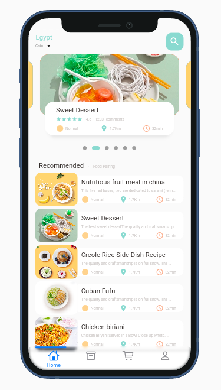
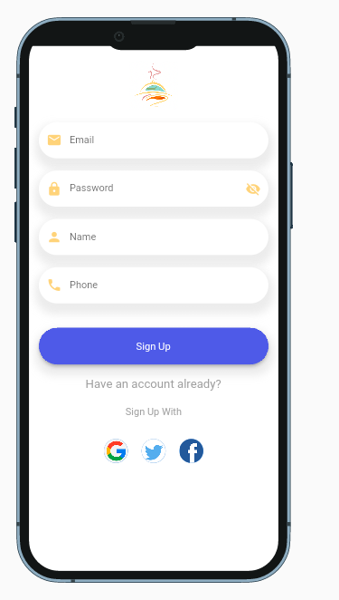
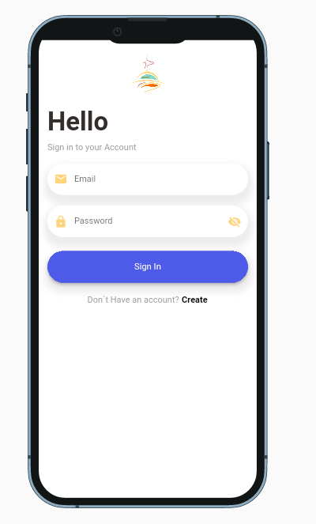

# Food Flutter App

#### Clean Code & Clean Structure with Getx And Real API.
#### Responsive UI.

#### Packages:
- get 
- flutter_screenutil
- dots_indicator
- persistent_bottom_nav_bar
- shared_preferences
- device_preview
# Screenshots 

